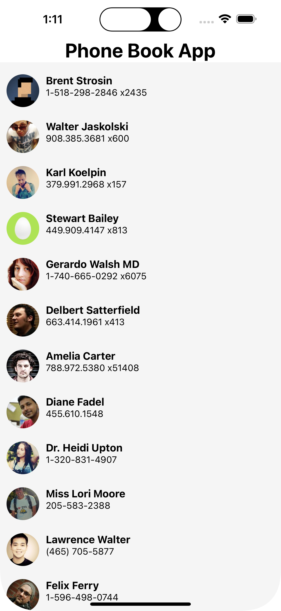

# Edu-ReactNative-PhoneBook
# React Native User List Application

This application is a simple user list app built with React Native and TypeScript. <br/>


## Features

- Fetching data from [MockAPI](https://mockapi.io/) using HTTP GET method with Axios.
- Displaying a list of users with FlatList.
- User information includes ID, Name, Avatar, Creation Date, Birth Date, Phone Number and Active Status.
- Searching functionality to filter users by their names.
- Loading indicator while fetching the data.
- Showing total number of users at the footer of the list.

## Getting Started

You can set up the application on your local machine by following these instructions:

1. Clone the repository: 
```bash
git clone https://github.com/yourusername/yourrepository.git
```

2. Navigate to the project directory:
```bash
cd yourrepository
```
3. Install the dependencies:
```bash
npm install
```
4. Run the application:
```bash
npx react-native run-android
// or

npx react-native run-ios
```


## Built With

- [React Native](https://reactnative.dev/) - A framework for building native apps using React.
- [TypeScript](https://www.typescriptlang.org/) - A statically typed superset of JavaScript.
- [Axios](https://github.com/axios/axios) - Promise based HTTP client for the browser and node.js.

## Acknowledgments

- The project uses the [MockAPI](https://mockapi.io/) for generating random user data.
- The application uses modern React hooks like useState and useEffect.
- The application is styled using React Native's StyleSheet API.
- The project demonstrates the usage of various React Native components like View, Text, TextInput, FlatList, Image, ActivityIndicator and SafeAreaView.
